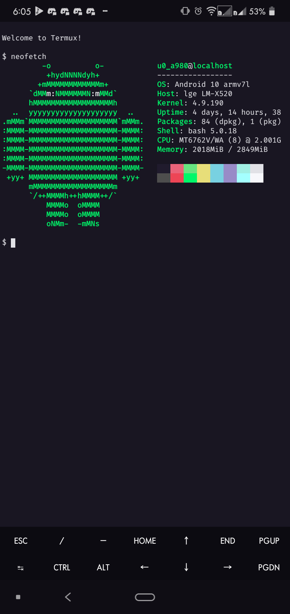

# Omni for [Termux](https://termux.com)
> :art: Omni theme for [Android Termux App](https://termux.com)
 

## inspiration
This theme is based on [Omni for Hyper](https://github.com/getomni/hyper-omni).

## Install
To install Download the [colors.properties](./colors.properties) file and move it to **~/.termux.** Open a new session or the application. :tada:
 
## Maintainers
 
|  |
| -------------------------------------------------------------------------------------------------------- |
| Guilherme Benevides                                                                                              |
 
## License
 
MIT License
